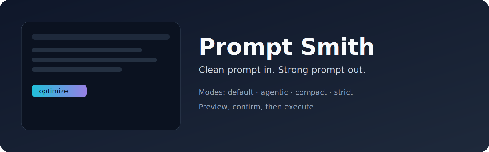

<p align="center">
  
</p>

<p align="center">
  
  
  
</p>

<h1 align="center">Prompt Smith</h1>

<p align="center">
  <strong>A slash command for <a href="https://github.com/anthropics/claude-code">Claude Code</a></strong> that optimizes rough prompts into cleaner, more executable versions.
</p>

<p align="center">
  <code>Requires Claude Code CLI — Run this command inside a Claude Code session</code>
</p>

---

> **What is Claude Code?** [Claude Code](https://github.com/anthropics/claude-code) is Anthropic's official agentic coding CLI. Prompt Smith adds a slash command that rewrites your prompts before execution.

---

## What It Does

Prompt Smith takes a rough prompt and **optimizes it** for Claude Code execution:

- **Optimize** — Rewrite for clarity, structure, and precision
- **Preview** — Show original and optimized side-by-side with a summary of what changed
- **Choose** — Pick or switch optimization modes
- **Edit** — Refine the optimized prompt before executing
- **Confirm** — Review before execution (or bypass with `--yes`)
- **Execute** — Run the optimized prompt immediately after confirmation

---

## Quick Start

```bash
# Add the marketplace (one-time)
claude plugin marketplace add maxencemeloni/claude-code-prompt-smith

# Install the plugin
claude plugin install prompt-smith

# Use (in any project)
claude
/prompt Refactor this function to be more readable
```

> **Update:** `claude plugin marketplace update prompt-smith-marketplace && claude plugin update prompt-smith@prompt-smith-marketplace`

---

## Command

| Command | Purpose |
|---------|---------|
| `/prompt` | Optimize a rough prompt with mode selection, preview, and confirmation |

### Syntax

```text
/prompt [--mode default|agentic|compact|strict] [--yes] [--dry-run] [--help] <prompt>
```

### Flags

| Flag | Purpose |
|------|---------|
| `--mode <mode>` | Select optimization mode (`default`, `agentic`, `compact`, `strict`) |
| `--yes` | Skip confirmation and execute immediately |
| `--dry-run` | Show optimized prompt without executing (preview only) |
| `--list-modes` | Show available modes |
| `--help` | Show usage information and examples |

### Examples

```text
/prompt Refactor this function to be more readable
```

```text
/prompt --mode agentic Organize the work in parallel and validate each step
```

```text
/prompt --mode compact Rewrite this prompt to be shorter
```

```text
/prompt --mode strict --yes Fix this prompt without changing its intent
```

```text
/prompt --dry-run Build a REST API with authentication
```

```text
/prompt --help
```

### Workflow

1. **Parse** — Extract flags and raw prompt from input
2. **Select mode** — Use explicit `--mode` or infer the best fit
3. **Preview** — Show mode, rationale, original, optimized prompt, and what changed
4. **Confirm** — Select an action: execute, edit, regenerate in another mode, or cancel
5. **Execute** — Run the optimized prompt in the same session

---

## Optimization Modes

| Mode | Purpose | Best For |
|------|---------|----------|
| **default** | General cleanup | Most prompts |
| **agentic** | Execution-focused structure | Orchestration, automation, multi-step delivery, repo work |
| **compact** | Shortest clean version | Utility prompts, when brevity matters |
| **strict** | Maximum fidelity | Sensitive wording, policy text, minimal rewrite |

---

## Sample Output

```markdown
Prompt Smith
Mode: agentic
Why this mode: prompt involves multi-step execution and delivery

Available modes:
  - default   — general cleanup
  - agentic   — orchestration and execution-focused structure
  - compact   — shortest clean version
  - strict    — maximum fidelity

Original prompt:
  refactor the auth module, add tests, and make sure nothing breaks

Optimized prompt:
  ## Objective
  Refactor the auth module while preserving all existing behavior.

  ## Workflow
  1. Read and understand the current auth module structure
  2. Identify refactoring opportunities (duplication, complexity, naming)
  3. Apply changes incrementally
  4. Add or update tests to cover refactored code
  5. Run the full test suite and verify no regressions

  ## Constraints
  - Do not change the public API surface
  - Every refactored path must have test coverage

What changed: restructured into sections, added explicit workflow steps, clarified constraints

┌─────────────────────────────────────┐
│  What would you like to do?         │
│                                     │
│  > Execute                          │
│    Edit                             │
│    Regenerate                       │
│    Cancel                           │
└─────────────────────────────────────┘
```

---

## Design Principles

| Principle | Meaning |
|-----------|---------|
| **Fidelity first** | Never silently change the user's intended outcome |
| **Claude Code native** | Output reads like a terminal instruction, not generic chat |
| **Minimal structure** | Add structure only when it helps execution |
| **Confirm by default** | Never execute without consent (unless `--yes`) |

---

## Install

```bash
# 1. Add the marketplace (one-time)
claude plugin marketplace add maxencemeloni/claude-code-prompt-smith

# 2. Install the plugin
claude plugin install prompt-smith
```

Works on all platforms.

```bash
# Update (refresh marketplace first, then update)
claude plugin marketplace update prompt-smith-marketplace
claude plugin update prompt-smith@prompt-smith-marketplace

# Uninstall
claude plugin uninstall prompt-smith@prompt-smith-marketplace
```

---

## Contributing

1. Fork the repo
2. Add/modify commands in `commands/`
3. Validate with `claude plugin validate .`
4. Submit a PR

See [CHANGELOG.md](./CHANGELOG.md) for the full changelog.

---

## Development

When working on Prompt Smith with Claude Code, the `CLAUDE.md` file at the project root provides development context including:

- **Design principles** — Fidelity first, Claude Code native, minimal structure
- **Mode definitions** — Rationale for each optimization mode
- **Version management** — How to bump versions and update documentation
- **Local testing** — How to test dev vs. plugin commands
- **Test prompts** — Sample prompts for verifying each mode

This context is only loaded when developing Prompt Smith itself, not when users run the command in their projects.

### Release

Use `/release <version> <description>` to automate the full release flow.

---

## More Claude Code Plugins

| Plugin | Command | Description |
|--------|---------|-------------|
| [Agent Smith](https://github.com/maxencemeloni/claude-code-agent-smith) | `/analyze-agent` | Analyzes, validates, and optimizes your Claude Code configuration. Full 7-pillar evaluation with interactive triage and guided fixes. |

[Check out Agent Smith for more details](https://agent-smith.mmapi.fr/)

---

## License

MIT — see [LICENSE](./LICENSE)

---

<p align="center">
  <a href="https://github.com/maxencemeloni/claude-code-prompt-smith">GitHub</a> ·
  <a href="https://prompt-smith.mmapi.fr/">Website</a>
</p>
